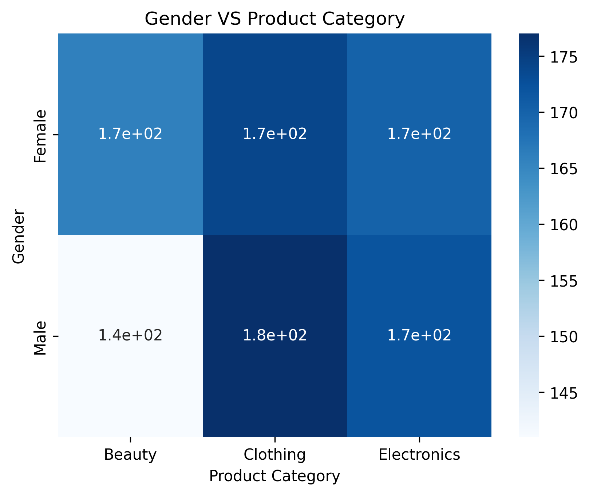
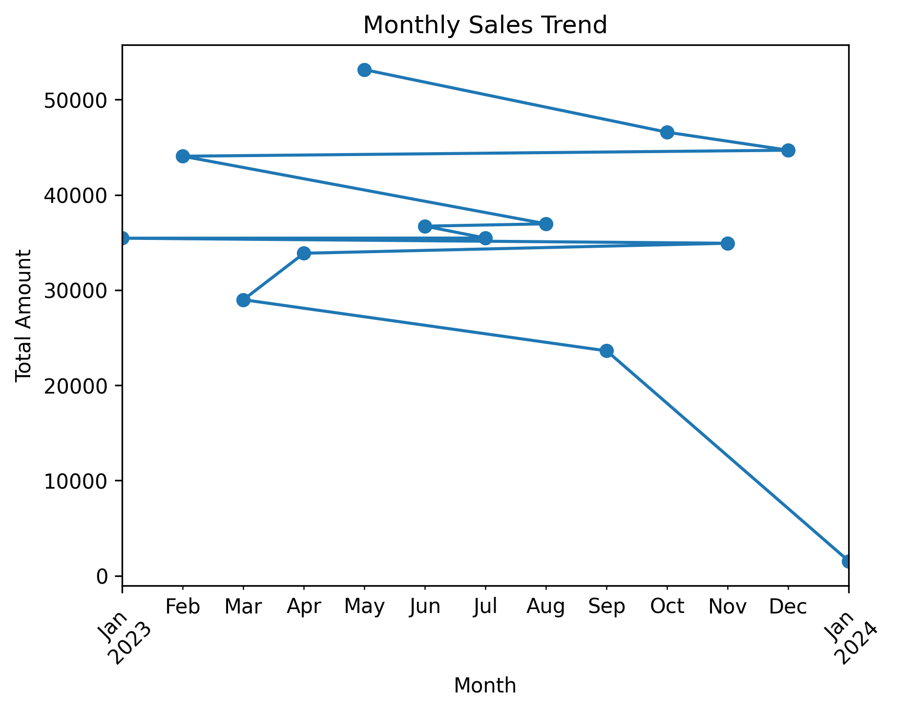
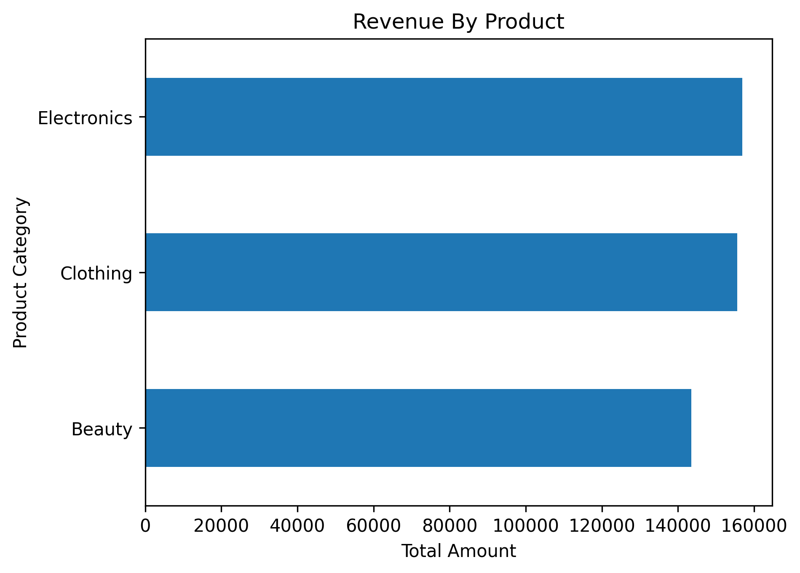
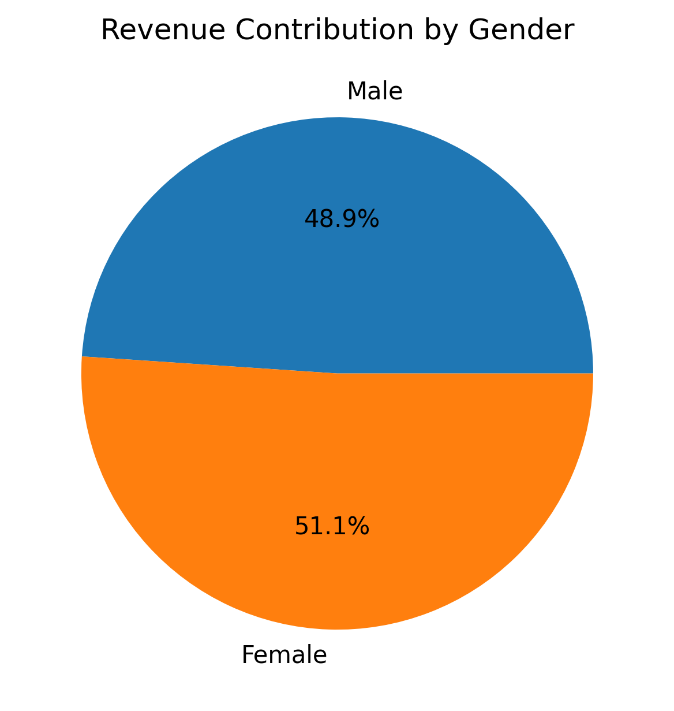
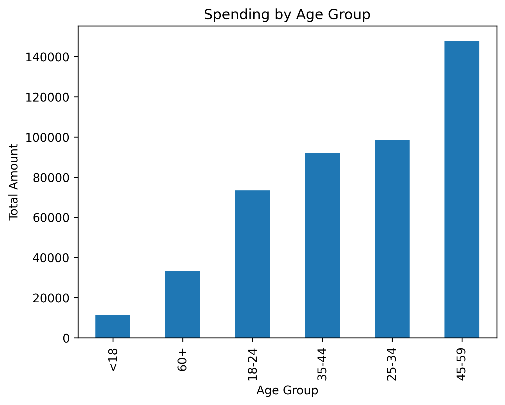
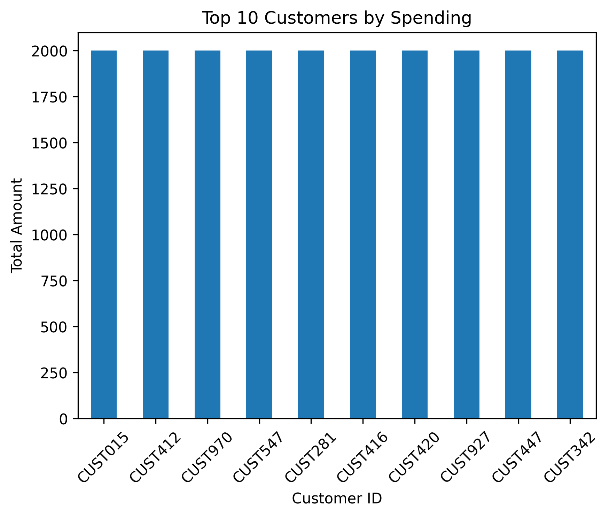

# Retail Sales Analytics Dashboard using Python

## Project Overview

This project analyzes retail transaction data using Python to uncover customer purchasing behavior, product performance, and revenue trends.

The project demonstrates the complete data analysis workflow—from loading and cleaning the data to performing exploratory data analysis (EDA), generating business insights, and creating professional visualizations.

## Project Objectives

- Analyze customer purchasing behavior
- Identify top-performing product categories
- Discover high-value customers
- Track monthly revenue trends
- Compare purchasing behavior across gender
- Analyze spending by age groups

## Tools & Technologies

- Python
- Pandas
- Matplotlib
- Seaborn
- Jupyter Notebook
- Git
- GitHub

## Dataset Columns

- Transaction ID
- Date
- Customer ID
- Gender
- Age
- Product Category
- Quantity
- Price per Unit
- Total Amount

## Analysis Performed

✔ Data Cleaning

✔ Exploratory Data Analysis (EDA)

✔ Revenue Analysis

✔ Customer Segmentation

✔ Product Category Analysis

✔ Top Customer Analysis

✔ Monthly Sales Trend

✔ Gender Analysis

✔ Age Group Spending Analysis

## Key Performance Indicators

- Total Revenue
- Revenue by Product Category
- Revenue by Gender
- Average Quantity per Customer
- Top 10 Customers
- Monthly Revenue Trend

## Dashboard Preview

### Gender VS Product Category

### Monthly Sales Trend

### Revenue By Product

### Revenue Contribution by Gender

### Spending By Age Group

### Top 10 Customers By Spending

## Key Insights

- Identified the highest revenue-generating product categories.
- Discovered the most valuable customers.
- Compared spending behavior across gender.
- Analyzed monthly revenue performance.
- Segmented customers by age group.
- Explored purchasing patterns using cross-tab analysis.

## Skills Demonstrated

- Data Cleaning
- Data Wrangling
- Exploratory Data Analysis
- Business Intelligence
- Data Visualization
- Customer Segmentation
- Time Series Analysis
- Python Programming

## Conclusion

This project demonstrates the complete data analysis process-from raw data preparation to business insight generations - using Python.It showcases practical skills in data cleaning, analysis, visualization, and communicating findings effectively.

## Author

**Handerson Mtakai**

Bachelor of Management & Leadership

Business Administration & Management

Aspiring Data Analyst | Python | SQL | Power BI | Excel

Connect with me on LinkedIn

